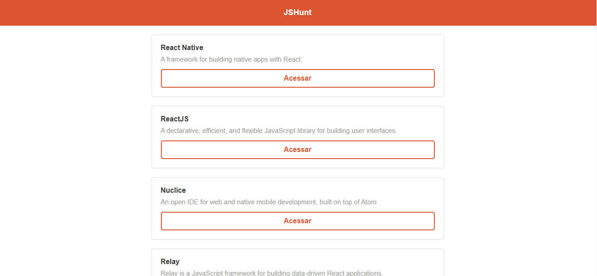

<h1 align="center">
    HUNTWEB
</h1>

<br />""

<h1 align="center">
    
</h1>

<p align="center">
  <a href="#-Sobre">Sobre</a>&nbsp;&nbsp;&nbsp;|&nbsp;&nbsp;&nbsp;
  <a href="#-projeto">Projeto</a>&nbsp;&nbsp;&nbsp;|&nbsp;&nbsp;&nbsp;
  <a href="#-tecnologias">Tecnologias</a>&nbsp;&nbsp;&nbsp;|&nbsp;&nbsp;&nbsp;
  <a href="#-como-clonar-e-executar-o-projeto">Como clonar e executar o projeto</a>
</p>

<br />

## 📑 Sobre

O **HUNTWEB** é um projeto básico de cadastro e listagem de repositórios do GitHub utilizando **NodeJS, MongoDB e ReactJS**.

---

## 💻 Projeto

O **HUNTWEB** é um projeto back-end e web construído no curso **Starter** da **Rocketseat**.

- No back-end foi construído todo o CRUD do cadastro de repositórios GitHub.

- Na aplicação web foi construída a interface de exibição dos repositórios GitHub cadastrados.

---

## 🚀 Tecnologias
Esse projeto foi desenvolvido com as seguintes tecnologias:

### Back-end
- [NodeJS](https://nodejs.org/)
- [JavaScript](https://www.javascript.com/)
- [Express](https://expressjs.com/)
- [Mongoose](https://mongoosejs.com/)

### Web
- [ReactJS](https://reactjs.org/)
- [JavaScript](https://www.javascript.com/)
- [Axios](https://github.com/axios/axios)

---

## 💾 Como clonar e executar o projeto

### Realizar o clone do projeto:
```bash
git clone https://github.com/aigorfreitas/huntweb.git
```

### Executar server Back-end:
```bash
# Abra a pasta /node-api e realize a instalação das dependências:
npm install

# Iniciar o server:
npm run dev

# Dica: Utilizar o programa Insomnia ou Postman para executar os médodos da API e criar os registros.
```

### Executar app Web:
```bash
# Abra a pasta /react-js e realize a instalação das dependências:
yarn install

# Iniciar o projeto web:
yarn start
```

---
Desenvolvido por 💜 **Alisson Igor Freitas de Oliveira**.